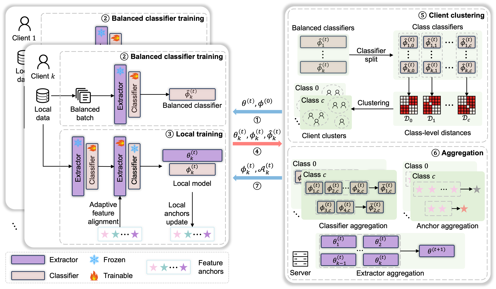

# FedCCFA: Classifier Clustering and Feature Alignment for Federated Learning under Distributed Concept Drift

This is the implementation of our paper: [Classifier Clustering and Feature Alignment for Federated Learning under Distributed Concept Drift](https://arxiv.org/abs/2410.18478) (NeurIPS 2024). 
In this paper, we propose a federated learning framework with classifier clustering and feature alignment (**FedCCFA**).



## 📦 Algorithms

This repository also provides the implementations of the following methods:

### Traditional Federated Learning

- **FedAvg**: [Communication-Efficient Learning of Deep Networks from Decentralized Data](https://proceedings.mlr.press/v54/mcmahan17a.html) AISTATS 2017
- **FedProx**: [Federated Optimization in Heterogeneous Networks](https://proceedings.mlsys.org/paper_files/paper/2020/hash/1f5fe83998a09396ebe6477d9475ba0c-Abstract.html) MLSys 2020
- **SCAFFOLD**: [SCAFFOLD: Stochastic Controlled Averaging for Federated Learning](http://proceedings.mlr.press/v119/karimireddy20a.html) ICML 2020
- **FedFM**: [FedFM: Anchor-Based Feature Matching for Data Heterogeneity in Federated Learning](https://ieeexplore.ieee.org/abstract/document/10286439) IEEE TSP 2023

### Personalized Federated Learning

- **pFedMe**: [Personalized Federated Learning with Moreau Envelopes](https://papers.nips.cc/paper/2020/hash/f4f1f13c8289ac1b1ee0ff176b56fc60-Abstract.html) NeurIPS 2020
- **Ditto**: [Ditto: Fair and Robust Federated Learning Through Personalization](https://proceedings.mlr.press/v139/li21h.html) ICML 2021
- **FedRep**: [Exploiting Shared Representations for Personalized Federated Learning](https://proceedings.mlr.press/v139/collins21a.html) ICML 2021
- **FedBABU**: [FedBABU: Toward Enhanced Representation for Federated Image Classification](https://openreview.net/forum?id=HuaYQfggn5u) ICLR 2022
- **FedPAC**: [Personalized Federated Learning with Feature Alignment and Classifier Collaboration](https://openreview.net/forum?id=SXZr8aDKia) ICLR 2023

### Clustered Federated Learning

- **IFCA**: [An Efficient Framework for Clustered Federated Learning](https://proceedings.neurips.cc/paper/2020/hash/e32cc80bf07915058ce90722ee17bb71-Abstract.html) NeurIPS 2020

### Concept Drift in Federated Learning

- **Adaptive-FedAvg**: [Adaptive Federated Learning in Presence of Concept Drift](https://ieeexplore.ieee.org/document/9533710) IJCNN 2021
- **FedDrift**: [Federated Learning under Distributed Concept Drift](https://proceedings.mlr.press/v206/jothimurugesan23a.html) AISTATS 2023
- **Flash**: [Flash: Concept Drift Adaptation in Federated Learning](https://proceedings.mlr.press/v202/panchal23a.html) ICML 2023
- **FedCCFA**: [Classifier Clustering and Feature Alignment for Federated Learning under Distributed Concept Drift](https://arxiv.org/abs/2410.18478) NeurIPS 2024

## 📄 Experiments

### Hyperparameters

All hyperparameters can be set in ./configs/*.yaml. Common hyperparameters in our experiments are list as follows:

| Hyperparameter | Values                                   | Description                                              |
|----------------|------------------------------------------|----------------------------------------------------------|
| client_num     | 20 or 100                                | 20 with full participation or 100 with 20% participation |
| sample_ratio   | 1 or 0.2                                 | full participation or 20% participation                  |
| dataset        | Fashion-MNIST or CIFAR10 or CINIC-10     | Three datasets in our experiments                        |
| alpha          | 0.1 or 0.5                               | concentration parameter in Dirichlet distribution        |
| drift_pattern  | false / sudden / incremental / recurrent | concept drift pattern                                    |

> The above numerical values (for client_num, sample_raio and alpha) are used in our experiments. You can select any
> value you want.

For the descriptions of other hyperparameters, please refer to our paper for more details.

### Example for FedCCFA under sudden drift setting

Edit configs/FedCCFA.yaml (e.g., set "drift_pattern" to "sudden").

```shell
cd methods
export PYTHONPATH=../
python3 FedCCFA.py
```

## 💡 Other Implementation

You can easily develop other FL algorithms by this repository.

First, create a new python script: entities/XXX.py

```python
from entities.base import Client, Server

Class XXXClient(Client):
    def __init__(self, client_id, args, train_set, test_set, global_test_id):
        super().__init__(client_id, args, train_set, test_set, global_test_id)
    
    def train(self):
        """New local training method if needed"""
        pass


Class XXXServer(Server):
    def __init__(self, args):
        super().__init__(args)
    
    def aggregate_by_params(self, clients):
        """New aggregation method if needed"""
        pass
```

Then, create a new python script: methods/XXX.py. Please refer to methods/FedAvg.py to implement new FL process.

## 🧑🏻‍💻 Bugs or Questions?

If you have any questions related to the code or the paper, feel free to email Junbao (junbaochen@bit.edu.cn). If you
encounter any problems when using the code, or want to report a bug, you can open an issue.

## 📝 Citation

If you find FedCCFA useful for your research, please consider citing our paper:

```
@article{chen2024classifier,
    title={Classifier Clustering and Feature Alignment for Federated Learning under Distributed Concept Drift},
    author={Chen, Junbao and Xue, Jingfeng and Wang, Yong and Liu, Zhenyan and Huang, Lu},
    booktitle={The Thirty-eighth Annual Conference on Neural Information Processing Systems},
    year={2024}
}
```